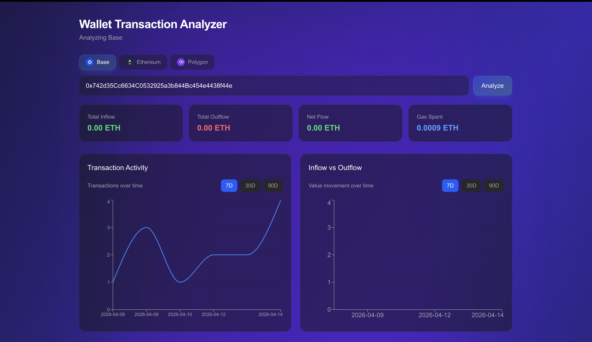
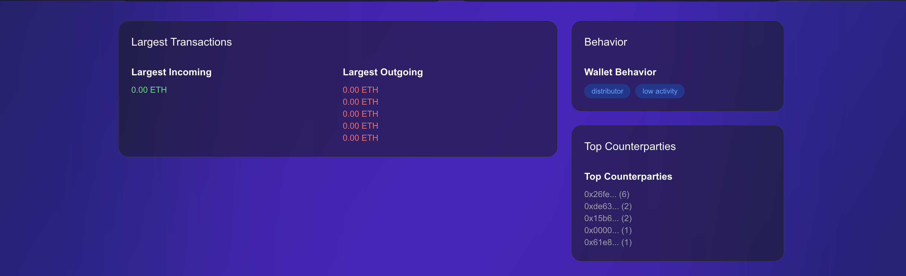
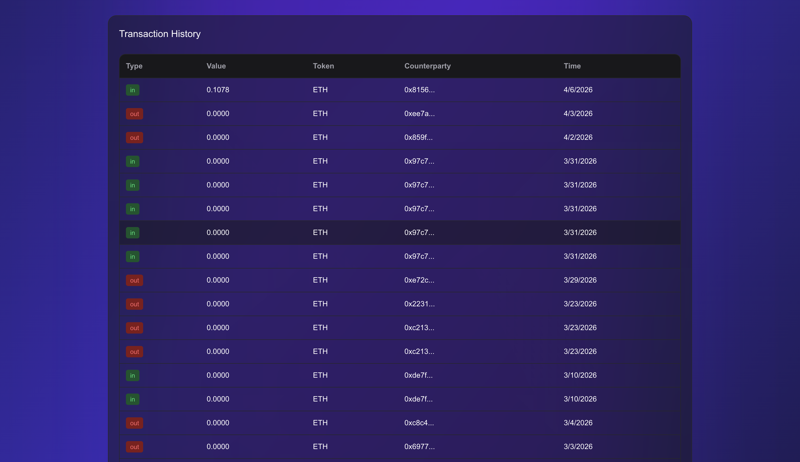

# 🚀 Web3 Wallet Transaction Analyzer

A **multi-chain Web3 wallet transaction analyzer** that helps you understand wallet behavior, transaction flow, and on-chain activity.

Built with **Next.js, TypeScript, Moralis, and Tailwind CSS**.

---

## 🌐 Live Demo

👉 [https://wallet-transaction-analyzer.vercel.app/analyzer]

---

## 📸 Preview






---

## ✨ Features

### 🔍 Wallet Analysis
- Analyze any public wallet address
- Multi-chain support (Base, Ethereum, Polygon)

### 📊 Transaction Insights
- Full transaction history (paginated)
- Inflow vs outflow tracking
- Largest transactions detection
- Gas usage insights

### 🧠 Smart Analytics
- Wallet behavior classification (accumulator, distributor, etc.)
- Counterparty analysis
- Activity patterns over time

### 📈 Visual Analytics
- Transaction activity chart
- Inflow vs outflow chart
- Time filters (7D / 30D / 90D)

### 🎨 UI/UX
- Glassmorphism design
- Gradient + glow background
- Responsive dashboard layout
- Real chain logos

---

## 🧱 Tech Stack

- **Frontend:** Next.js (App Router), React, TypeScript  
- **Styling:** Tailwind CSS  
- **Data Provider:** Moralis API  
- **Web3 Utilities:** viem  
- **Charts:** Recharts  
- **State Management:** React Query  

---

## ⚙️ Architecture Highlights

- Clean **feature-based architecture**
- Normalized transaction model
- Server-side data fetching
- Modular analytics layer
- Cursor-based pagination
- Chain-agnostic design

---

## 📂 Project Structure

src/
├── app/
│ ├── analyzer/
│ └── api/
│
├── components/
│ ├── wallet/
│ └── common/
│
├── features/
│ └── wallet-analyzer/
│ ├── hooks/
│ ├── utils/
│ ├── types/
│ └── constants/
│
├── lib/
│ ├── api/
│ └── viem/
│
└── server/
└── wallet/

---

## 🚀 Getting Started

### 1. Clone the repo

```bash
git clone https://github.com/khalilahmed63/web3-wallet-transaction-analyzer.git
cd web3-wallet-transaction-analyzer
```
### 2. npm install

```bash
npm install
```

### 3. Set up environment variables
Create .env.local
```bash
MORALIS_API_KEY=your_api_key_here
```

### 4. Run the app


```bash
npm run dev
```

### 🧪 Try It With
##### Example wallet:
```bash
0x742d35Cc6634C0532925a3b844Bc454e4438f44e
```

###### Paste it into the app to see real data.

---

### 🔑 How It Works

- User inputs wallet address
- API fetches data via Moralis
- Transactions are normalized
- Analytics layer computes insights
- UI renders charts + behavior

---

### 📌 Roadmap

 - Multi-chain aggregation (combine all chains)
 - Wallet labeling (CEX / DEX / contracts)
 - ENS support
 - PnL estimation
 - Export reports (CSV / PDF)
 - Real-time updates

 ---
 
### 🤝 Contributing

Feel free to fork, improve, and submit PRs.

---

### 👨‍💻 Author

#### Khalil Ahmed

- 🌐 https://www.khalilahmed.dev
- 💼 https://www.linkedin.com/in/developer-khalil-ahmed/
- 🐙 https://github.com/khalilahmed63

---

### ⭐ Support

#### If you like this project, give it a ⭐ on GitHub!


---
